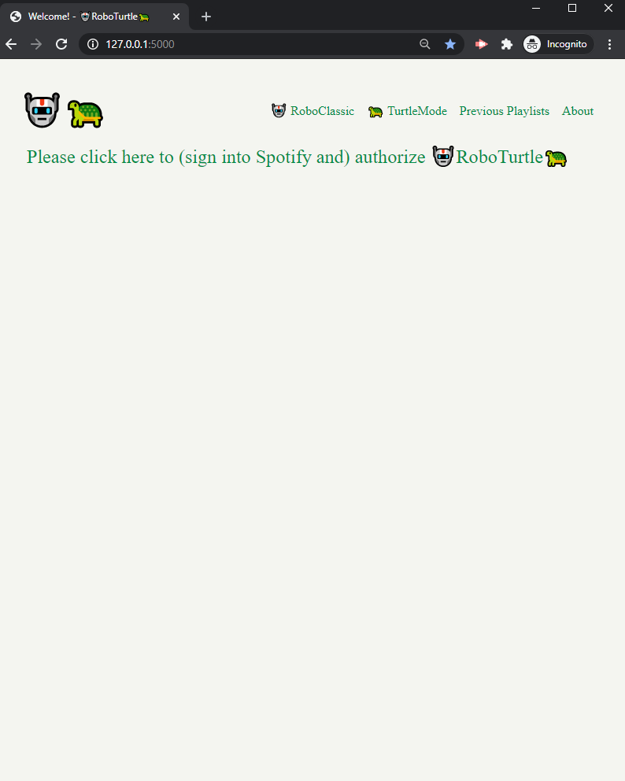
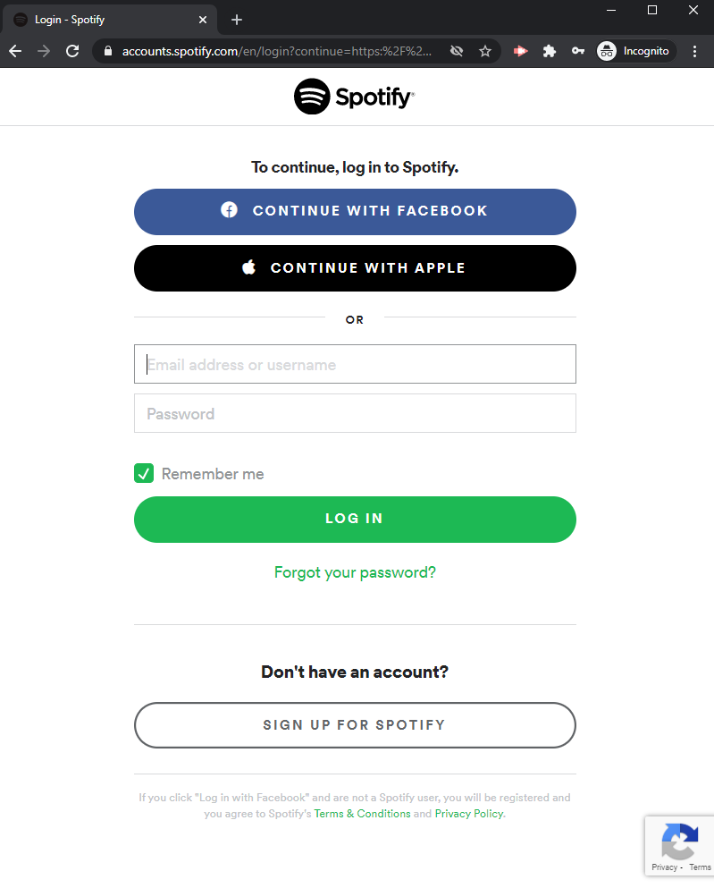
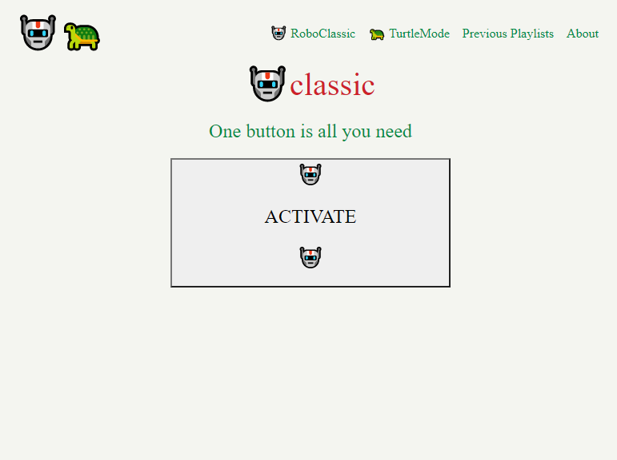
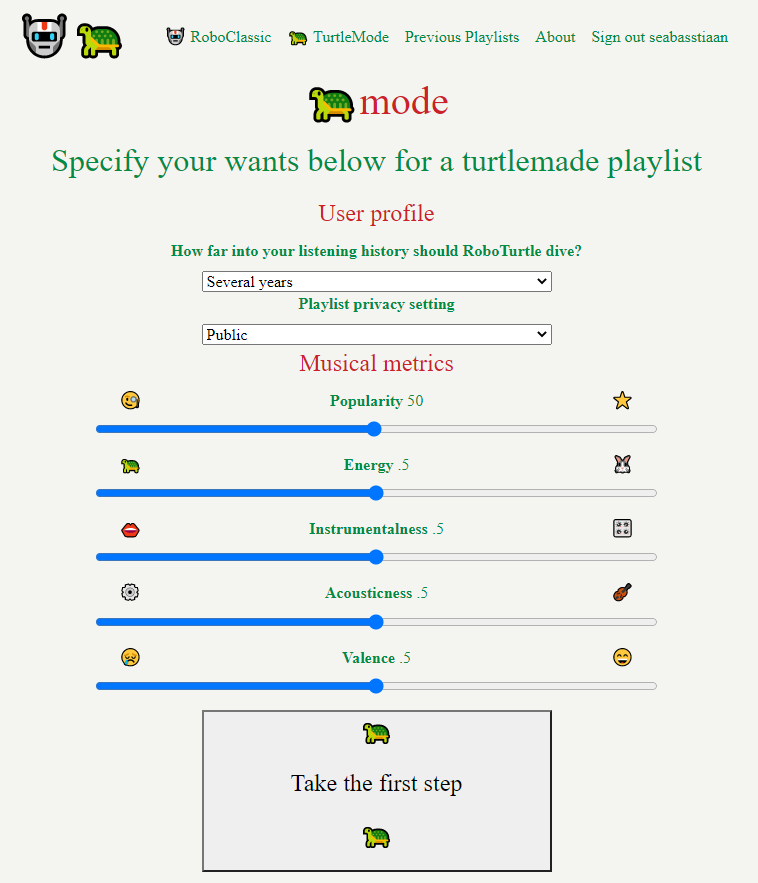
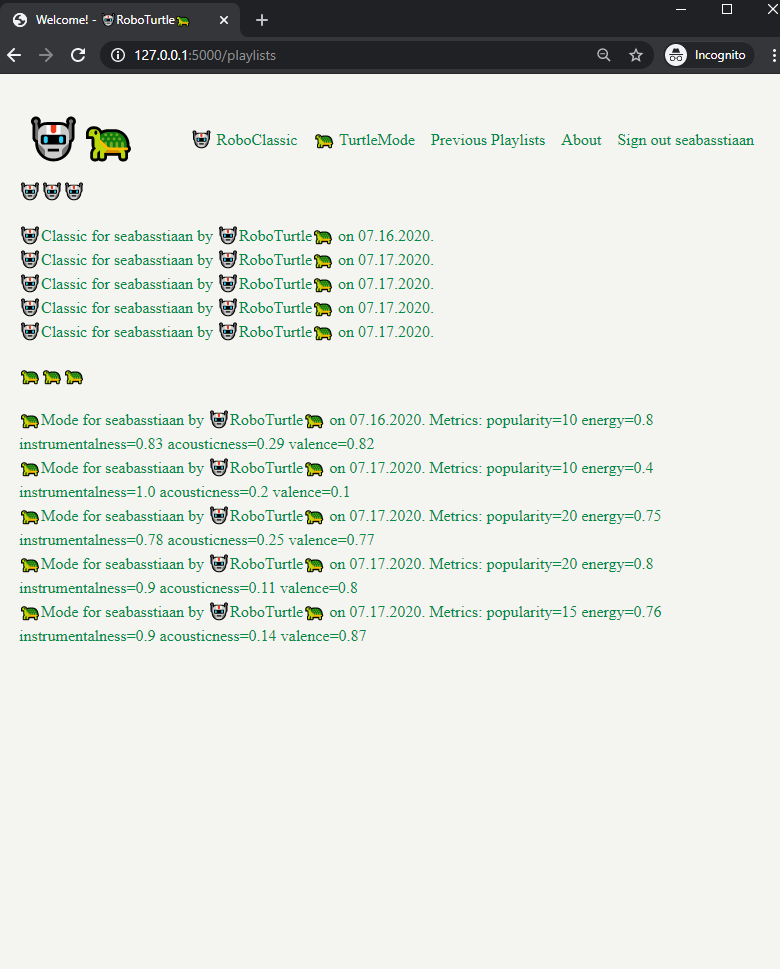
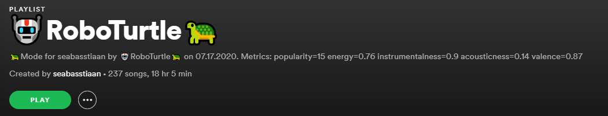

# DESIGN for 🤖RoboTurtle🐢

By Sebastiaan van der Laan as final project as part of WebApps, minor programmeren.

### "/" Index / Signin

First time users sign into Spotify to authorize RoboTurtle. Upon success they are redirected towards "/classic".

## "/classic" 🤖Classic

Allows users to generate a playlist with one click.

application.py instantiates a RoboTurtle object imported from roboturtle.py, and calls upon the classic() function. The classic function delegates the work to other functions. After ~10 seconds it flashes the resulting playlist link.

## "/turtlemode" 🐢Mode

Allows users to handpick metrics to create a playlist with. The metrics are entered into an API request for track recommendations.

application.py retrieves all the information from the HTML form, instantiates a RoboTurtle object imported from roboturtle.py, and calls upon the turtle() function, with the form information as **kwargs, to delegate to other functions. After ~10 seconds it flashes the resulting playlist link.

## /playlists

Shows all the RoboTurtle-made playlists.

application.py instantiates a RoboTurtle object imported from roboturtle.py, and calls upon the .list_playlists() function, which in turn queries the SQL database. The resulting playlist objects are rendered, sorted, and each links to spotify.

## Result

The result is a playlist in Spotify with a number of songs, and a fitting description. 🐢Mode playlist descriptions include the metrics they were made with, these are added to the description in the create_playlist function in roboturtle.py

