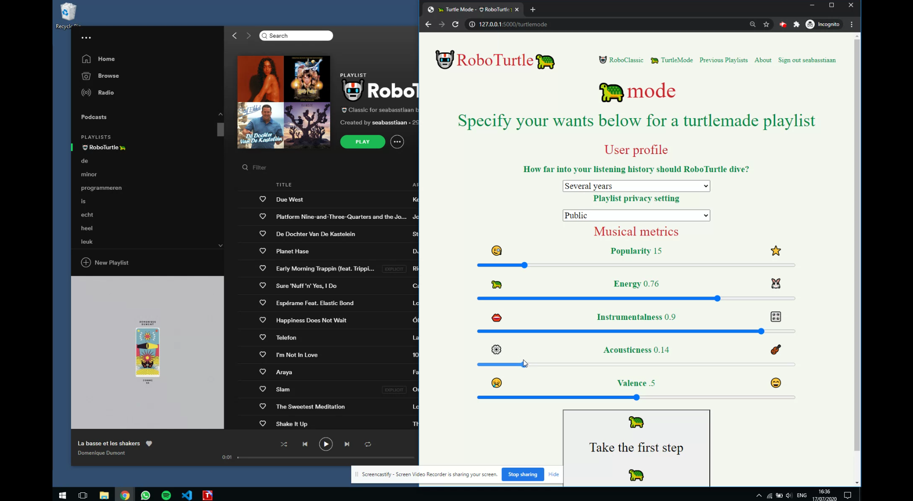

# 🤖RoboTurtle🐢 README

By Sebastiaan van der Laan as final project as part of WebApps, minor programmeren.

## Description

🤖RoboTurtle🐢 is an easy-to-use app for creating Spotify playlists

## setup

Run the following commands to visit the local host.

    pip install requirements.txt
    flask run

## Use

Sign in with your spotify account and then use either:

* 🤖Classic: Click once for a great tailormade playlist.
* 🐢Mode: State your preferences for a great turtlemade playlist.

After which you are presented with a link that opens the created playlist in your Spotify client.

## 🤖Classic

## 🐢Mode

## Video introduction to 🤖RoboTurtle🐢

🤖RoboTurtle🐢 worldwide launch (NL) has been captured and can be viewed below.

## Words from the author
It cannot be left unsaid that 🤖Robo and Turtle🐢 stand on the shoulders of, and imported, Spotipy. Thanks go out to its creators without whom all of this would not have been possible.

    Paul Lamere, Spotipy, (2020), A light weight Python library for the Spotify Web API, https://github.com/plamere/spotipy

## Thanks!
Thank you for reading! Enjoy 🤖RoboTurtle🐢